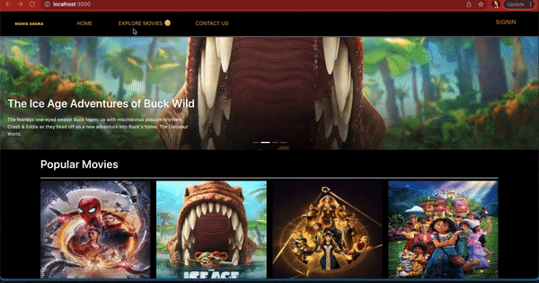

## MovieArena - Movie Search and Review Portal

This Application is created as a part of INFO6150 Course Final Project.
This is an Online Movie Search and Review Portal developed using MERN Stack.

# Features implemented:
This application fetches recent movies from TMDb. Users can view Popular Movies Trailers and its Details
They can search and share the movie details to friends via Fb, Twitter, Instagram, Mail,…
Registered users can add Movie Reviews and view all the reviews
They can tag movies as Favorites and view save their custom favorite collection.
There is like option to show the like count of how many users have favorited a particular movie.

# How to Run:
Clone this repo
In the terminal go to client and server locations.
Do npm install to load the modules
Do npm start in both client and server to run this application.

Note: This needs connection to MongoDB server. Please update the mongoDB Connection before running it.
